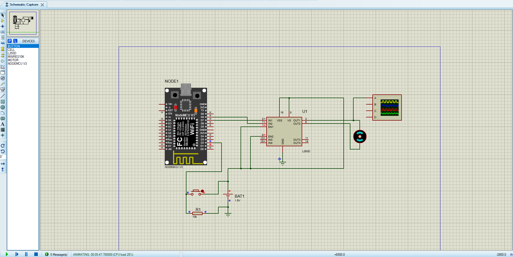

# Arduino PWM Controller 🎛️

Projeto de controle de velocidade de motor DC utilizando PWM (Pulse Width Modulation) com NodeMCU V3 e driver L293D.

---

## Índice

1. [Introdução ao PWM](#introdução-ao-pwm)
2. [Componentes necessários](#componentes-necessários)
3. [Esquemático](#esquemático)
4. [Código-fonte](#código-fonte)
5. [Instruções de montagem](#instruções-de-montagem)
6. [Funcionamento do projeto](#funcionamento-do-projeto)

---

## Introdução ao PWM

**PWM (Pulse Width Modulation)** ou Modulação por Largura de Pulso é uma técnica utilizada para controlar a quantidade de energia entregue a um dispositivo eletrônico, como um motor DC, variando a largura dos pulsos de um sinal digital.

O sinal PWM alterna rapidamente entre **HIGH (5V)** e **LOW (0V)**. O que determina a potência entregue é o **Duty Cycle** — a porcentagem de tempo em que o sinal permanece em HIGH dentro de um período.

| Valor `analogWrite` | Duty Cycle | Tensão média | Velocidade do motor |
|---------------------|------------|--------------|---------------------|
| 0                   | 0%         | 0V           | Parado              |
| 64                  | 25%        | ~1.25V       | Lenta               |
| 127                 | 50%        | ~2.5V        | Média               |
| 191                 | 75%        | ~3.75V       | Rápida              |
| 255                 | 100%       | ~5V          | Máxima              |

No Arduino/NodeMCU, a função `analogWrite(pino, valor)` gera esse sinal PWM com valores entre **0 e 255**.

---

## Componentes necessários

| Componente         | Quantidade | Descrição                                      |
|--------------------|------------|------------------------------------------------|
| NodeMCU V3         | 1          | Microcontrolador principal (ESP8266)           |
| L293D              | 1          | Driver para motor DC (ponte H)                 |
| Motor DC           | 1          | Motor de corrente contínua 5V                  |
| Botão (Push Button)| 1          | Para controle de velocidade                    |
| Resistor 10kΩ      | 1          | Pull-down para o botão                         |
| Bateria 5V         | 1          | Fonte de alimentação do motor                  |
| Protoboard         | 1          | Para montagem do circuito                      |
| Jumpers            | -          | Fios de conexão                                |

---

## Esquemático

O esquemático do circuito está disponível na pasta `/schematics`:

```
schematics/
└── image.png
```



**Descrição das conexões principais:**

- **NodeMCU D7 (GPIO13)** → Pino EN1 do L293D (controle PWM)
- **NodeMCU D9 (GPIO3)** → Pino IN1 do L293D (direção)
- **NodeMCU D6 (GPIO12)** → Pino IN2 do L293D (direção)
- **L293D OUT1/OUT2** → Terminais do motor DC
- **Bateria 5V** → VS do L293D (alimentação do motor)
- **Botão** → Entrada digital do NodeMCU com resistor pull-down de 10kΩ

---

## Código-fonte

O código completo está disponível em `/src/main.cpp`.

### Exercício 01 — PWM básico com variação de velocidade

```cpp
#include <Arduino.h>

void setup() {
}

void loop() {
  analogWrite(7, 64);
  delay(1000);

  analogWrite(7, 127);
  delay(1000);

  analogWrite(7, 191);
  delay(1000);

  analogWrite(7, 255);
  delay(1000);

  analogWrite(7, 0);
  delay(1000);
}
```

### Exercício 02 — Controle de velocidade por botão

```cpp
#include <Arduino.h>

const int pinoBotao = 2;
const int pinoPWM   = 7;

int velocidade = 0;
bool ultimoEstadoBotao = LOW;

void setup() {
  pinMode(pinoBotao, INPUT);
  pinMode(pinoPWM, OUTPUT);

  analogWrite(pinoPWM, 0);
}

void loop() {
  int leitura = digitalRead(pinoBotao);

  if (leitura == HIGH && ultimoEstadoBotao == LOW) {
    velocidade += 64; 

    if (velocidade > 255) {
      velocidade = 0;
    }
    analogWrite(pinoPWM, velocidade);
  }
  ultimoEstadoBotao = leitura;
}
```

---

## Instruções de montagem

**1. Preparar o ambiente PlatformIO**
   - Instale o [VS Code](https://code.visualstudio.com/) e a extensão **PlatformIO IDE**
   - Crie um novo projeto: `PlatformIO > New Project`
   - Selecione a placa **NodeMCU 1.0 (ESP-12E Module)**

**2. Montar o circuito**
   - Conecte o NodeMCU V3 na protoboard
   - Conecte o L293D conforme o esquemático em `/schematics/image.png`
   - Conecte o motor DC nas saídas OUT1 e OUT2 do L293D
   - Conecte a bateria de 5V ao pino VS do L293D
   - Conecte o botão com resistor pull-down de 10kΩ

**3. Compilar e gerar o firmware**
   - Cole o código em `src/main.cpp`
   - Clique em **Build** (✓) para compilar
   - O arquivo `firmware.hex` será gerado em: `.pio/build/<nome_do_ambiente>/firmware.hex`

**4. Simular no Proteus**
   - Abra o Proteus e monte o circuito
   - Clique duas vezes no componente Arduino/NodeMCU
   - Em **Program File**, selecione o `firmware.hex` gerado
   - Clique em **Play** para simular

---

## Funcionamento do projeto

### Como o motor responde ao PWM

O **L293D** é um driver de motor (Ponte H) que permite controlar a direção e velocidade de motores DC. O pino **EN (Enable)** recebe o sinal PWM do NodeMCU e determina a velocidade:

```
NodeMCU (PWM) ──► L293D (EN) ──► Motor DC
```

- Quando o pino EN recebe `analogWrite(pino, 255)` → motor em **velocidade máxima**
- Quando recebe `analogWrite(pino, 0)` → motor **parado**
- Valores intermediários resultam em velocidades proporcionais

### Ciclo de funcionamento (Exercício 01)

```
[Parado] → [25%] → [50%] → [75%] → [100%] → [Parado] → (repete)
   0          64      127     191      255        0
```

Cada estágio dura **1 segundo** (`delay(1000)`), fazendo o motor acelerar gradualmente e depois parar, em loop infinito.

### Controle por botão (Exercício 02)

Cada vez que o botão é pressionado, a velocidade aumenta em **25%** (incremento de 64). Ao ultrapassar 255, a velocidade volta a 0 (motor para). Isso cria 5 níveis de velocidade controlados pelo usuário:

```
Pressão 1 → 25%  (64)
Pressão 2 → 50%  (127)
Pressão 3 → 75%  (191)
Pressão 4 → 100% (255)
Pressão 5 → 0%   (0) → reinicia o ciclo
```

---

## Estrutura do repositório

```
Arduino_PWM_Controller/
│
├── src/
│   └── main.cpp          # Código-fonte principal
│
├── schematics/
│   └── image.png         # Esquemático do circuito
│
├── .gitignore            # Arquivos ignorados pelo Git
└── README.md             # Este arquivo
```

---

## Licença

Projeto acadêmico desenvolvido para fins educacionais.